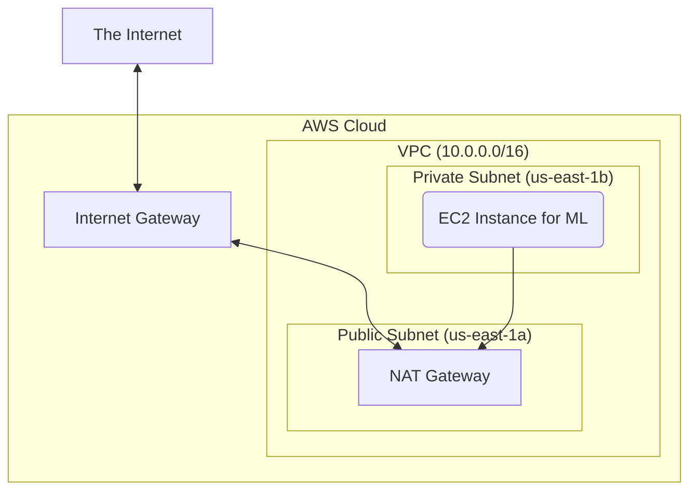

# terraform-aws-secure-ai-sandbox

================================
# Terraform Module: Secure AWS AI/ML Sandbox

A production-ready Terraform module for provisioning a secure, scalable, and HIPAA-ready network foundation on AWS. This module is designed to serve as a reusable "VPC factory" for AI/ML teams, enabling them to quickly and safely spin up isolated environments for model training, experimentation, and deployment.

-----

## Architecture

This module provisions a foundational Virtual Private Cloud (VPC) with a multi-AZ, public/private subnet topology. This design ensures both high availability and a strong security posture by isolating sensitive workloads.

  * **VPC:** Creates an isolated network environment with a `/16` CIDR block.
  * **Public Subnets:** Designed for internet-facing resources like load balancers or NAT Gateways. Resources here can receive inbound traffic from the internet.
  * **Private Subnets:** Designed for backend applications and sensitive workloads, such as model training instances or databases. These resources cannot be accessed directly from the internet.
  * **Internet Gateway (IGW):** Provides the VPC with a connection to the public internet.
  * **NAT Gateway:** Deployed in a public subnet, it allows resources in the private subnets to initiate outbound traffic (e.g., for software updates or API calls) while blocking unsolicited inbound connections.

### Architecture Diagram

-----

## Features

  * **Security-First Design:** Follows AWS Well-Architected principles, placing workloads in private subnets by default to minimize the attack surface.
  * **High Availability:** Deploys resources across multiple Availability Zones (`us-east-1a`, `us-east-1b`) to protect against single-zone failures.
  * **Scalable:** The `/16` VPC CIDR range provides ample IP space for future expansion.
  * **Reusable Module:** Easily integrated into larger Terraform configurations for different environments (dev, staging, prod).

-----

## Usage

To use this module in your own Terraform project, you would reference it as follows:

module "ai_sandbox" {
  source = "github.com/your-username/terraform-aws-secure-ai-sandbox"
  
  aws_region = "us-east-1"
}

### Prerequisites

  * Terraform v1.x or later installed.
  * AWS CLI installed and configured with appropriate IAM credentials.

### Deployment Steps

1.  **Initialize the project:**
    
    terraform init
   
2.  **Generate an execution plan:**
    
    terraform plan -out=tfplan
    
3.  **Apply the plan:**
    
    terraform apply "tfplan"
   

-----

## Security Considerations

This module was built with security as a top priority, incorporating several best practices:

1.  **Principle of Least Exposure:** No resources, other than the NAT Gateway, are directly exposed to the internet. All sensitive compute resources are intended for the private subnets.
2.  **Segregated Network Layers:** The public/private subnet design ensures a clear separation between the internet-facing network layer and the secure application layer.
3.  **Controlled Egress:** The use of a NAT Gateway ensures that outbound traffic from private subnets originates from a single, known IP address, which can be whitelisted by external services. Inbound traffic is explicitly denied.

-----

## Outputs

Upon successful application, this module will output the following values:

| Name                | Description                               |
| ------------------- | ----------------------------------------- |
| `vpc_id`            | The ID of the created VPC.                |
| `public_subnet_id`  | The ID of the public subnet.              |
| `private_subnet_id` | The ID of the private subnet.             |